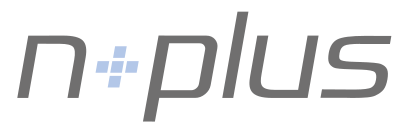

# nscale Plus Pack

Das *nscale Plus Pack* (kurz *nplus*) bietet Werkzeuge, um das *Enterprise Information Management* System [nscale](https://ceyoniq.com/produkte/) in einer **mandantenfähigen** und **hochverfügbaren** Laufzeitumgebung **einfach** betreiben zu können. Seitens des [Herstellers (Ceyoniq)](https://ceyoniq.com) werden aktuell ausschließlich [Beispielkonfigurationen für verschiedene Infrastrukturen](https://github.com/ceyoniq/container) geliefert. 

Hier setzt *nplus* an und bietet den nscale Nutzern zusätzliche Werkzeuge für den Betrieb in komplexen Umgebungen.

## Kubernetes (k8s)

Für den Betrieb in einem Kubernetes Cluster bietet *nplus*:

- Versionierte *helm Charts* für alle *nscale* Komponenten zur Installation, Update und Deinstallation
- Die nscale Komponenten (Application Layer, Storage Layer, Web, CMIS, ...) können in beliebigen Kombinationen zu *Applikationen* zusammengefasst werden.
- Es können mehrere *Applikationen* in einem Kubernetes Namespace laufen (z.B. *Mandant1*, *Mandant2* und *Centralservices*)
- Ein Namespace kann dann ein Mandant sein (z.B. *Sales*) oder eine Stage (z.B. *prod*, *qa* oder *dev*), falls man mehrere Stages auf einem Cluster laufen lassen möchte.
- Umbrella Charts für komplexe Umgebungen, inkl. 
    - optionales LDAP Directory, 
    - optionales zentrales Single Sign On mit Multi-Faktor-Auth, 
    - optionale Datenbank
    - optionale S3 Anbindung für den Storage Layer

- Unterstützung von AppDynamics
- Unterstützung von snc (zum Zugriff auf SAP Systeme)

## Konventionell (K11l)

Auch für den konventionellen Betrieb auf klassischen Virtuellen Maschinen ist ein passendes Tooling notwendig, um das Deployment zu unterstützen, den Betrieb zu überwachen und Hochverfügbarkeit zu ermöglichen.

*nplus* bietet hier:

- automatisierte Konfiguration von Load Balancern auf Basis von 
- Health Checks, die permanent das System überwachen.
- Konfigurationen für Failover Konzepte. (Layer 3, Layer 4, und Layer 7)
- automatisierung des Deployments

## Was *nplus* nicht ist

*nplus* liefert weder Software noch Dienstleistung zu nscale. nscale Lizenzen, nscale Versionen, nscale Support, nscale Consulting etc. sind nach wie vor direkt bei Ceyoniq zu beziehen.

# Details

- Pro Kubernetes Namespace wird ein zentraler Storage für die Applikationen zur Verfügung gestellt: *conf* und *data*. 
    - Der conf Store ist per git versioniert. Hier liegen alle config Files aus allen Applikationen eines Namespaces.
    - Der data Store ist für Nutzdaten (Datenbank, Storage Layer etc.) und kann so leicht gesichert werden.

- Applikationen innerhalb eines Namespace teilen sich
    - den Service Account, Role, Rolebindung für das Kubeping.
    - ein Secret für den Zugriff auf die Registry der Ceyoniq
    - ein Secret für den Zugriff auf die Registry der 42i GmbH
    - optional eine ConfigMap mit der Lizenz der Ceyoniq

- Das Registry Secret der 42i ist gleichzeitig auch die Lizenz der 42i.
- Versionierung:
    - Die Chart Version der *nplus* und *nplus-argocd* Charts entspricht der NAPPL Version.
    - Die App Version entspricht dem helm git Tag.
    - Die Chart Version der solo Charts (*nappl*, *web*, ...) entspricht den jeweiligen Image Versionen
- damit auch mehrere Applikationen in einem Namespace existieren können (z.B. ns *LAB*), werden die Objekte mit dem `.Release.Name` als Prefixen versehen, wenn sich `.Release.Name` und  `.Release.Namespace` unterscheiden.
- Ingress: Zertifikate werden über einen Issuer (z.B. cert-manager) automatisch erstellt, deployt und erneuert.
